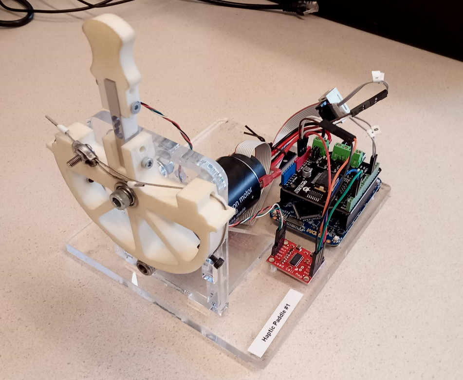

# Haptics Paddle



This repo contains a K64F MCU program for Arvids's Haptics Paddle, a demonstration set-up for admittance control.

The set-up consists of a lever on top of a loadcell, attached by to a DC motor by string transmission. A microcontroller controls the motor with a desired haptic mode.

## Usage

Connect the first micro-USB port (marked `SDA USB`) to your computer to power the board and do serial communication.

Also connect the second USB port (marked `K64F USB`) and use the [uScope](https://bitbucket.org/ctw-bw/uscope) (HID version) to graph data.

You can use the serial terminal to change e.g. model parameters. Do this by typing entries like:

```
m=3.5
```

Read the serial start-up prompt for a list of parameters.

## Hardware

 * [MBED K64F microcontroller](https://os.mbed.com/platforms/FRDM-K64F/)
 * [Maxon DC Motor](https://www.me-systeme.de/shop/en/sensors/torque-sensors/ts/ts703)
 * [HX711](https://www.sparkfun.com/products/13879) loadcell amplifier
 * [DFRobot 2x2A DC](https://www.dfrobot.com/product-69.html) motor shield
 * 9V or 12V DC adapter

On the HX711 development kit, the RATE pad on the bottom was broken, to increase the output rate from 10 Hz to 80 Hz.  

The exact type of the Maxon motor is not known. It can be used with a 9V or 12V supply.

## Calibration

The HX711 plus strain sensor were roughly calibrated by hanging a known weight from the end.
The value found was 31 V/Nm. This won't be accurate, but should be the right order of magnitude.

## Connections

The motor shield should be stacked on top of the K64F. The jumpers on the motor shield should be set to `PWRIN`, such that the external power supply is used.

The female 2.1 mm DC jack should be connect to the `PWRIN +/-` terminals on the motor shield.

The `M1 +/-` of the motor shield should be connected to the plus and minus of the motor. (The order of + and - for the motors will flip the direction but otherwise matters not.)

The Maxon motor encoder cable has 10 pins. The layout can be found in https://www.maxongroup.com/medias/sys_master/8815046230046.pdf, under 'Encoder Cable Connector J4'. Only `+`, `-`, `A` and `B` are needed.

On small HX711 breakout board, connect:

 * `GND` to MCU ground
 * `VCC` to MCU +5V
 * `DT` to `D2` on the MCU
 * `SCK` to `D3` on the MCU
 * `E+` to the sensor Vcc (red wire)
 * `E-` to the sensor ground (black wire)
 * `A+` to the sensor output 1 (white wire)
 * `A-` to the sensor output 2 (green wire)

On the K64F, connect:

 * `D2` and `D3` to the amplifier (see above)
 * `D12` to encoder channel B
 * `D13` to encoder channel A
 * `GND` and `5V` to both the encoder and the HX711

Baked into the motor shield are the connections:

 * `D4` direction motor 2
 * `D5` PWM motor 2
 * `D6` PWM motor 1
 * `D7` direction motor 1

## Compilation

The program can be compiled locally with MBED Studio, or using the online compiler at [mbed.org](https://mbed.org).

MBED includes submodules through the .lib files. They are not literal Git submodules.
